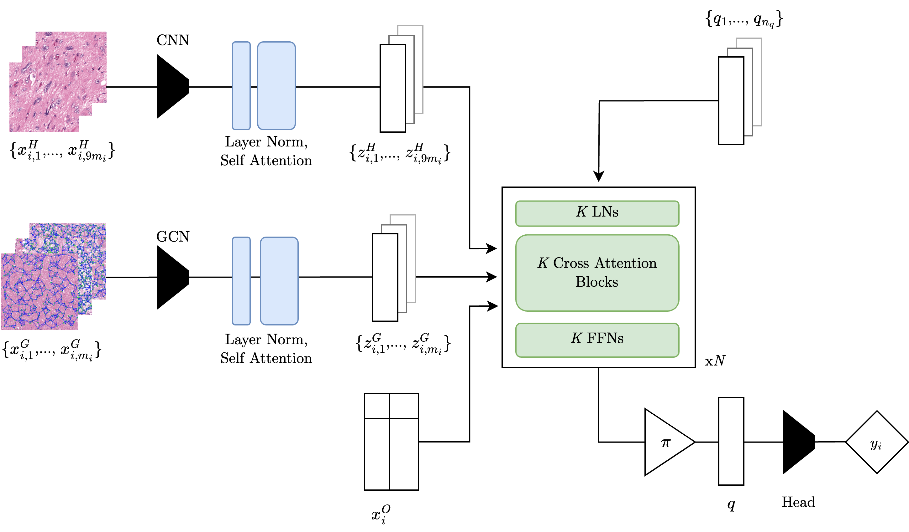

# M3IL: Multi-Modal Multi-Instance Learning in Computational Pathology

This repository contains the code that accompanies the thesis "Multi-Modal Multi-Instance Learning in Computational Pathology", found in the report directory.



## Installation
The required packages are included in the env.yml file. To install the environment, run the following command:
```bash
conda env create -f env.yml
```
Activate with:
```bash
conda activate m3il
```


## Usage
There are over 50 model variants that have been implemented in this project, all of which can be trained using the train.py script using command line arguments. The key arguments include:
- `--mode`: Combination of modalities to use, specified as any of 'path', 'graph', 'omics', as a single string in that order. For example, 'path' would only use the path modalities, while 'pathomic' would use both path and omic modalities.
- `--task`: The task to train the model on, `grad` for grade classification, `surv` for survival regression, and `multi` for multitask training.
- `--mil`: The multiple instance learning framework to use. `global` and `local` employ true MIL, whereas `PFS` emulates the original authors pseudo fully supervised approach.

Default training parameters will automatically update depending on the model combination to be aligned with the report and original paper (though they are free to be overridden). For more information on available arguments, see `src/tools/options.py`.

### Example

To train a model using the pathomic modalities for grade classification using the global MIL framework with attention pooling, run the following command:

```bash
python train.py --mode pathomic --task grad --mil global --pool attn
```

or to reproduce the papers survival analysis results for the trimodal model, run:

```bash
python train.py --mode pathgraphomic --task surv --mil PFS
```

The QBT model has a number of specific hyperparameters that are prefaced with `qbt_`. These can be set using the command line arguments. For example, to train the trimodal QBT model with 16x32 latent space, run:

```bash
python train.py --mode pathgraphomic --task grad --mil global --qbt_queries 16 --qbt_dim 32
```


## Data
The required data is available from the original study on [Google Drive](https://drive.google.com/drive/folders/1swiMrz84V3iuzk8x99vGIBd5FCVncOlf)

This project expects the data to be in a slightly modified structure:
```
data
├── graphs
│   ├── ...
├── omics
│   ├── all_dataset.csv
│   ├── grade_dataset.csv
│   ├── mRNA_Expression_z-Scores_RNA_Seq_RSEM.txt
│   ├── mRNA_Expression_Zscores_RSEM.txt
├── path
│   ├── patch
│   │   ├── ...
│   ├── ROIs
│   │   ├── ...
├── splits
│   ├── pnas_splits.csv

```
